 ## DAHSBOARD

Para el proyecto, se realizo una entrevista con el usuario final, asi
obtener los requerimientos necesarios, luego se realizo los bocetos
de baja y alta fidelidad, y finalmente creación de la web.

**1.- Quiénes son los principales usuarios del producto?**

    Los principales usuarios del producto son los Training Manager de Laboratoria.

**2.- Cuáles son los objetivos de estos usuarios en relación con el producto?**

    - Tener una tendencia, por turnos, de un cohort, el progreso de 
      completitud, ejercicios autocorregidos, lecturas y Quizzes.

    - Realizar comparaciones de las tendencias entre turnos de un mismo cohort.

    - Tener una web funcional y adaptable (poder utilizarlo desde cualquier equipo).

    - Tener una información confiable.

    - Tener un diseño mantenga la marca de Laboratoria.

**3.- Cuáles son los datos más relevantes que quieren ver en la interfaz y por qué. Cómo los descubriste?**

    Los datos mas relevantes para la training manager es visualizar es una estadistica general del 
    progreso de completitud de ejercicios autorregidos por cohort y realizar comparaciones de los datos entre 
    el turno de la mañana y la tarde.
    
**4.- Cuándo revisan normalmente estos datos los usuarios.**

    Lo revisa cada fin de proyecto. Sin embargo la training manager nos comento que mas adelante lo revisaran antes de cada 
    proyecto pero todavíano se tiene una fecha establecida.

**5.- Cómo crees que el producto les está resolviendo sus problemas.**
    
    El producto final resuelve sus problemas del usuario de manera basica, ya que le permite visualizar los porcentajes
    de completitud, ejercicios, lecturas y quizzes. Sin embargo no los muestra en un grafico estadistico y no permite hacer 
    la comparación de datos automaticamente.

**6.- Cómo fue tu proceso de diseño.**

    Para el proceso de diseño primero se realizo una entrevista para entender los requerimientos de la usuaria,
    luego procedimos a realizar un boceto de baja fidelidad, y recibimos un feedback de nuestro boceto, mas tarde procedimos 
    armar un boceto final de baja fidelidad dinámico para tener una idea mas clara por la usuaria y nosotras.
    Con el ultimo boceto de baja fidelidad comenzamos a construir el prototipo de alta fidelidad, posterior a ello armamos el
    maquetado de HTML.

A continuación presentamos los materiales utilizados para realizar la página:

1.- CUESTIONARIO

      1.- Que información quisieras visualizar el Dashboard?
      2.- Podrias brindarnos una jerarquia entre todas las evaluciones?
      3.- Hasta el momento como verificas el desempeño de las estudiantes de Laboratoria?      
      4.- Que proceso consideras que te genera perdida de tiempo?
      5.- Te gustaría ver graficos?
      6.- Es necesario poder exportar los datos o estadisticas en un excel?

**2.- BOCETO DE BAJA CALIDAD**

- Interfaz de Login de Usuario

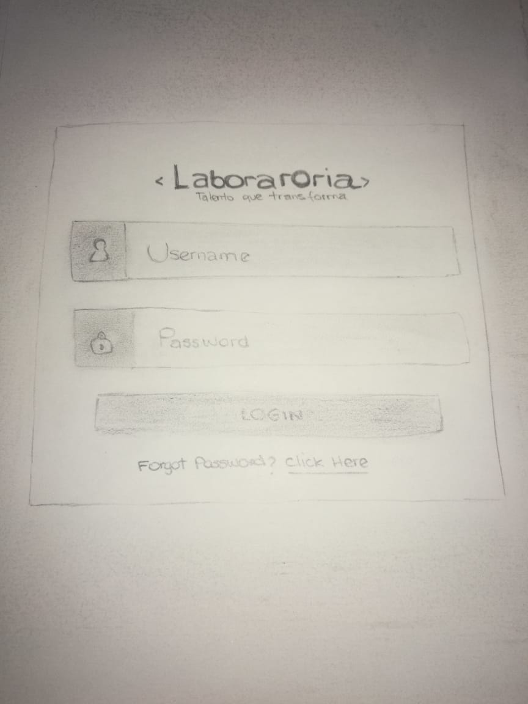

- Se realiza  click boton de sedes, para  filtrar las sedes

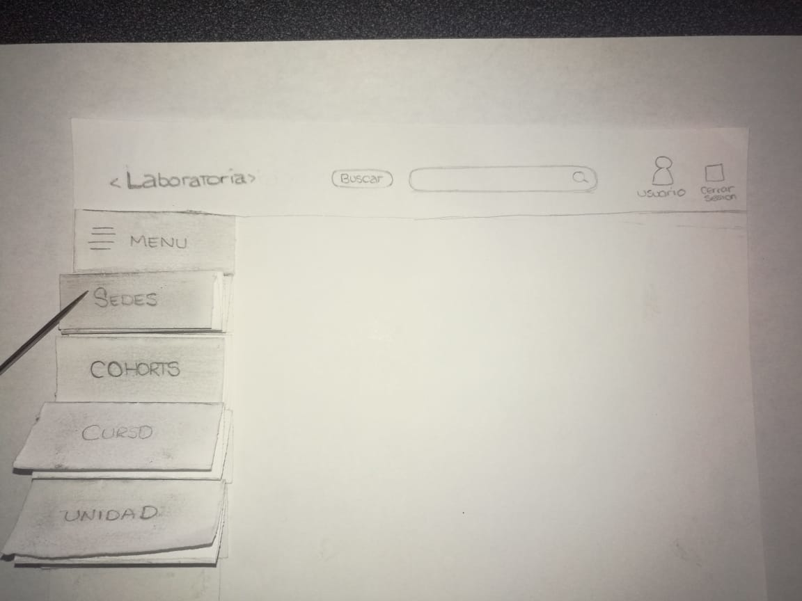

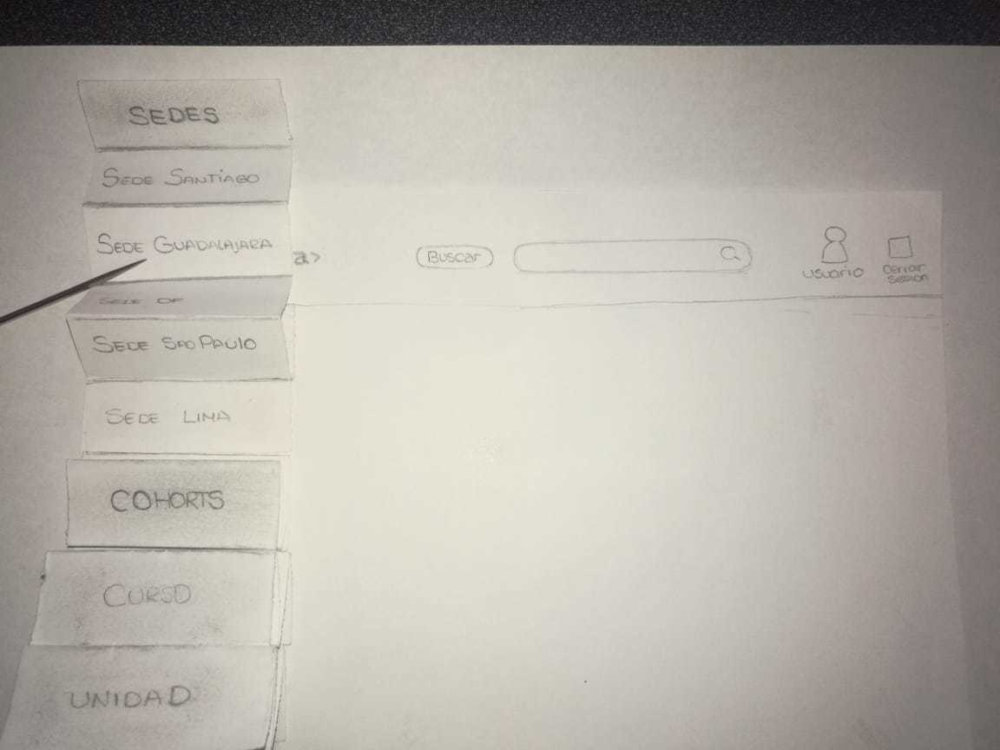

- Se realiza click en boton Cohort, para filtrar los cohorts

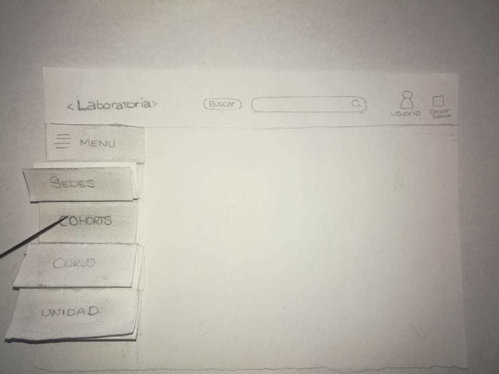

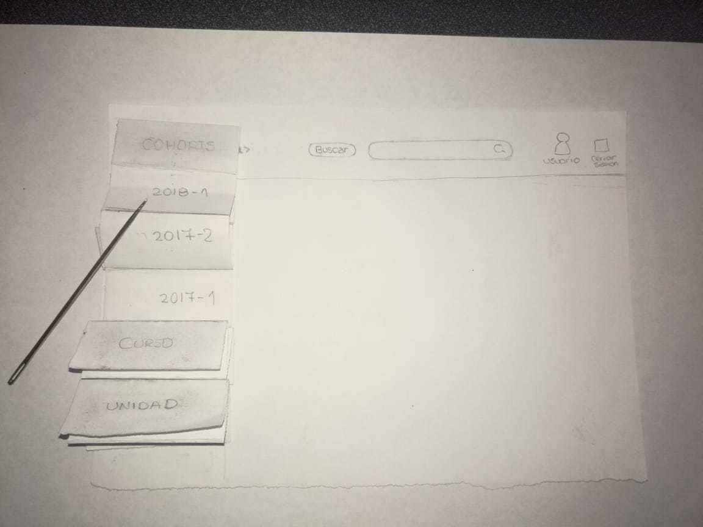

- Se muestra lista de estudiantes con el porcentaje de completitud de Ejercicios , Quizes y Lecturas

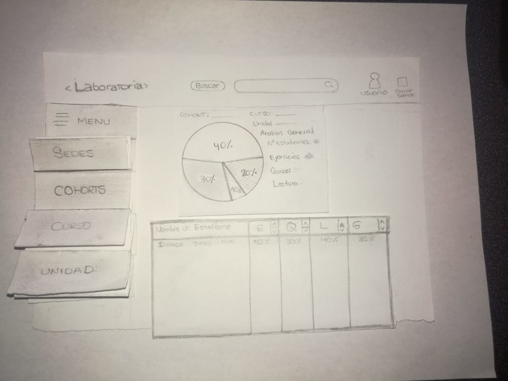

- Se realiza click en buscar para filtrar el nombre de un estudiante y permite seleccionar a uno.

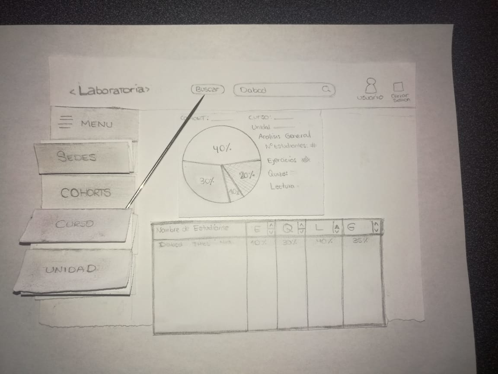

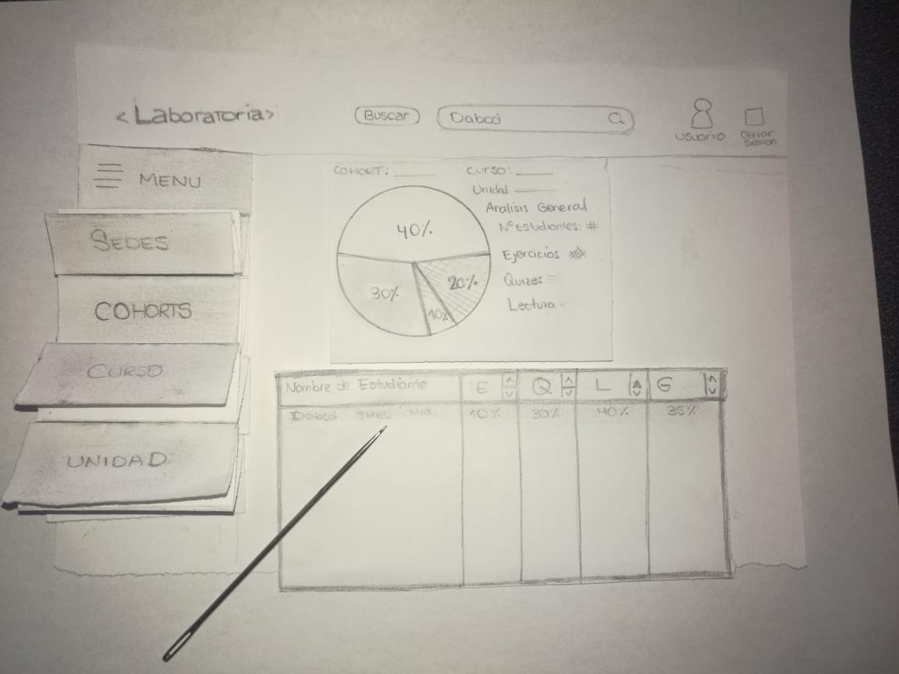

- Se visualiza el detalle de completitud de cada curso.

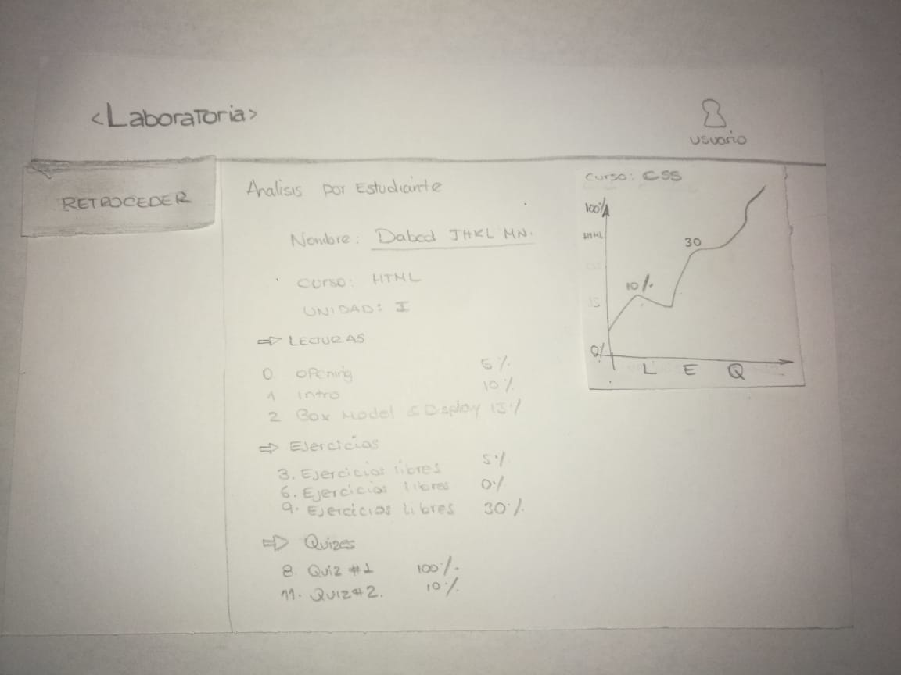

**3.-  PROTOTIPO DE ALTA CALIDAD**

- Login de Usuario

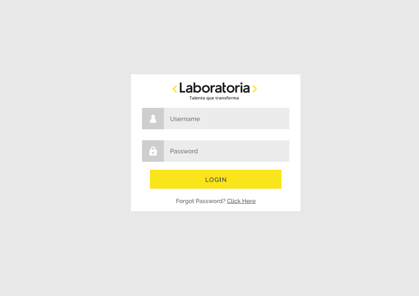

- Menu Principal y Tabla de Estudiantes

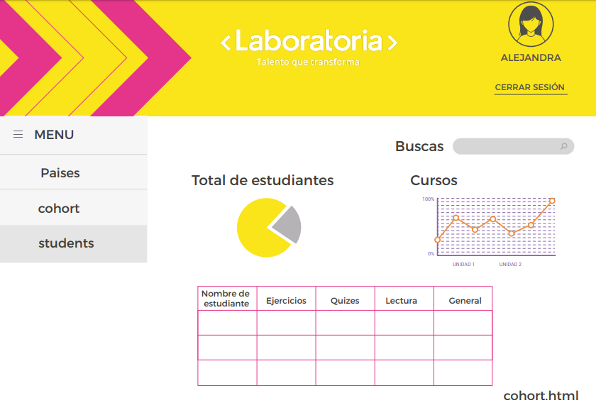

- Detalle de progreso por estudiante

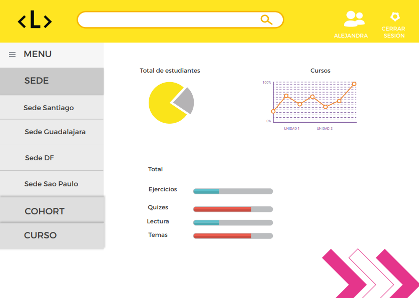

**SPRINT # 1**

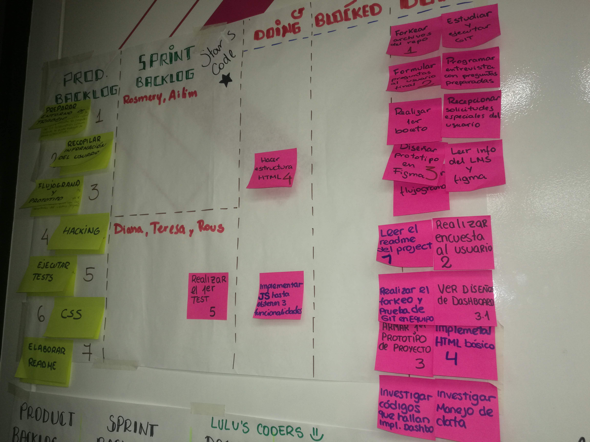

**SPRINT # 2**

**SPRINT # 3**

